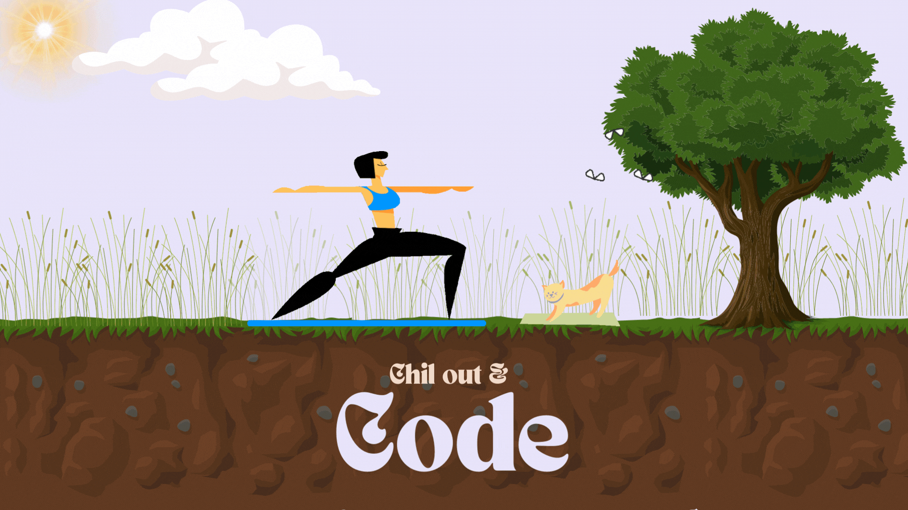

# <em><b>👋 Hi, I'm ANUPAMA!</em><b>

👩🏻‍💻 Software Engineer sharing about my journey and learnings in tech 
👩🏻‍🎓 Studied Computer Science And Engineering 

  

- 🌱 I’m currently learning **React Native**

- 📫 How to reach me **deyanupama18@gmail.com**

- ⚡ Fun fact **I think**

<h3 align="left">Connect with me:</h3>

  
<a href="https://twitter.com/anupama_dey_" target="blank"><i class="fa-brands fa-square-x-twitter"></i></a>

<h3 align="left">Languages and Tools:</h3>

            

&nbsp;

